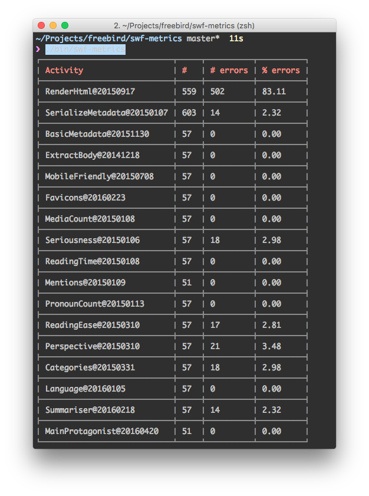
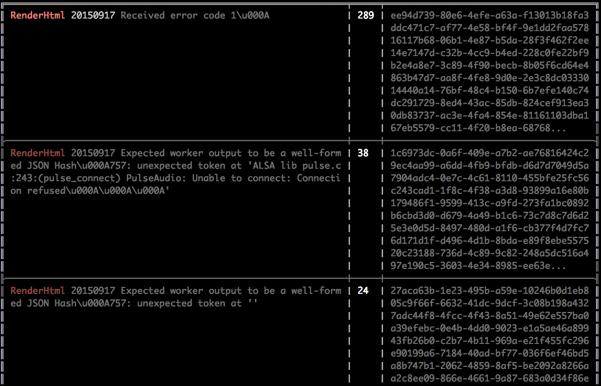

# swf-metrics

> Introspective metrics and breakdowns of pending and finished AWS Simple Workflow executions.

# Use

```bash
swf-metrics <command> --domain <domain> [options]

Commands:
  failed [--no-breakdown]  Display metrics about failed workflows.

Options:
  --domain   SWF domain to get metrics from                  [string] [required]
  --for      Duration of time of data to retrieve since the value of --since.
             Eg: 6hours, 1day, etc.               [string] [default: [1,"hour"]]
  --since    Position in time from which we start retrieving the history of
             data.                [string] [default: "2016-10-11T15:12:44.270Z"]
  --help     Show help                                                 [boolean]
  --version  Show version number                                       [boolean]
```

## Failed workflows

```
swf-metrics failed
```




